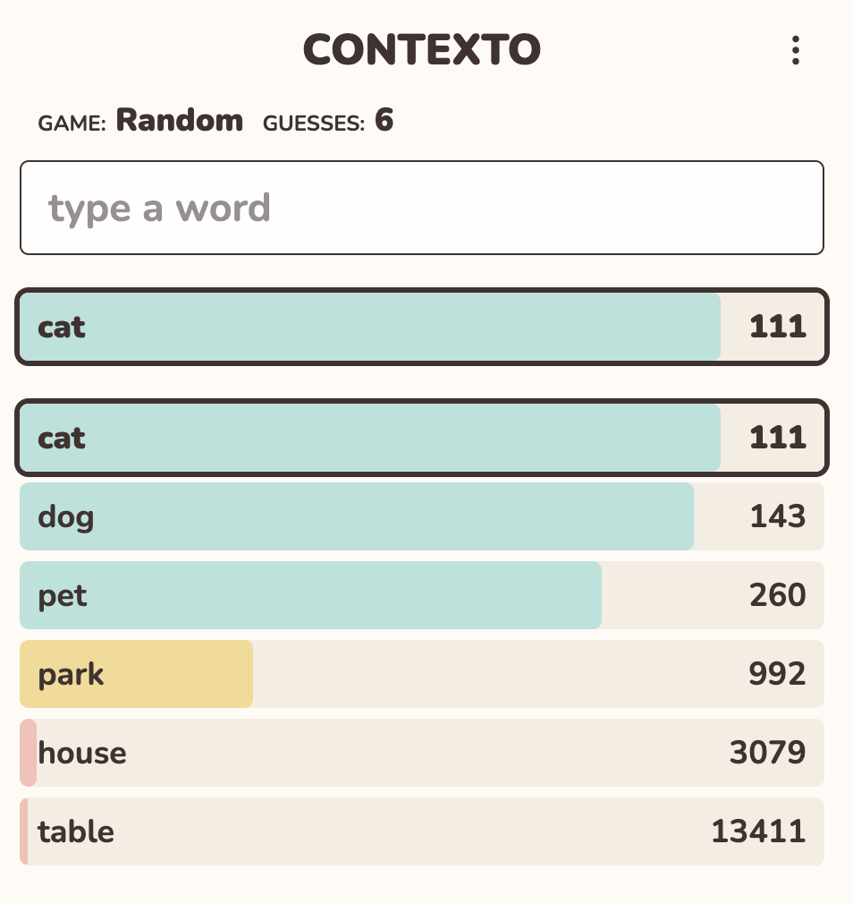
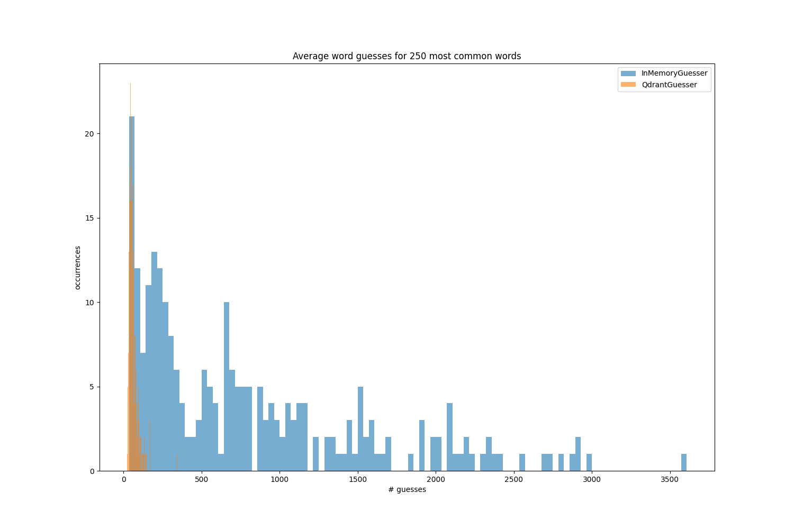
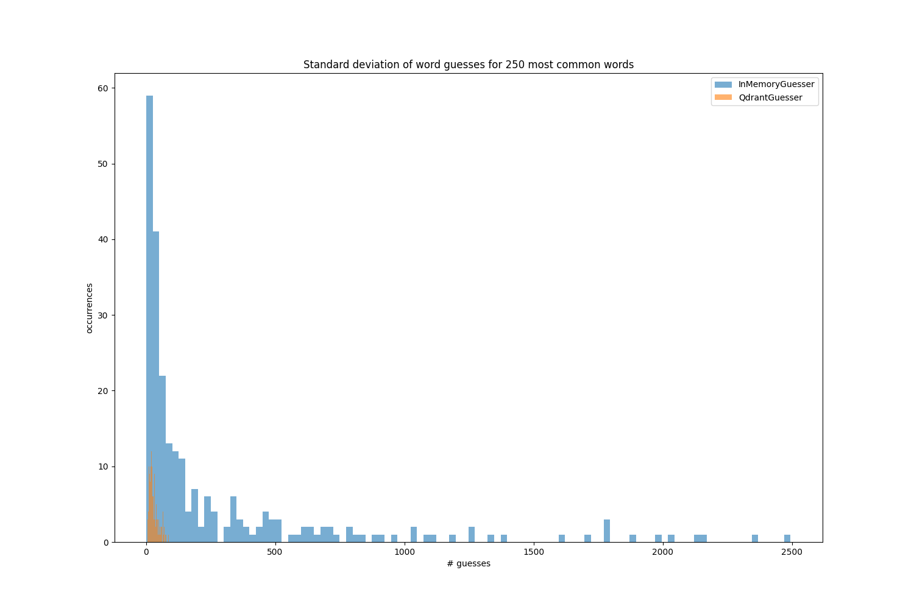
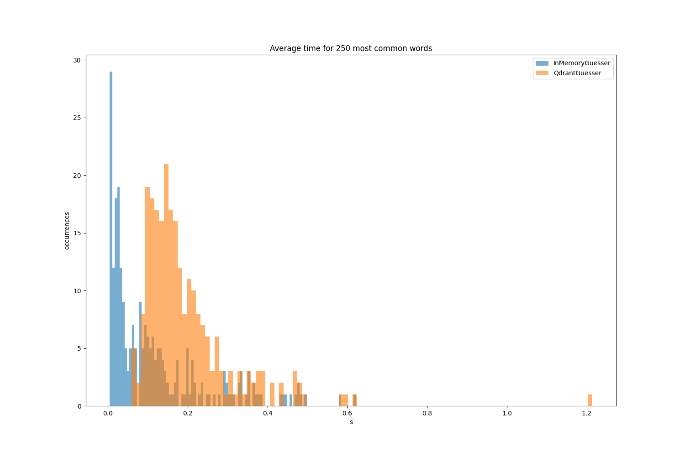
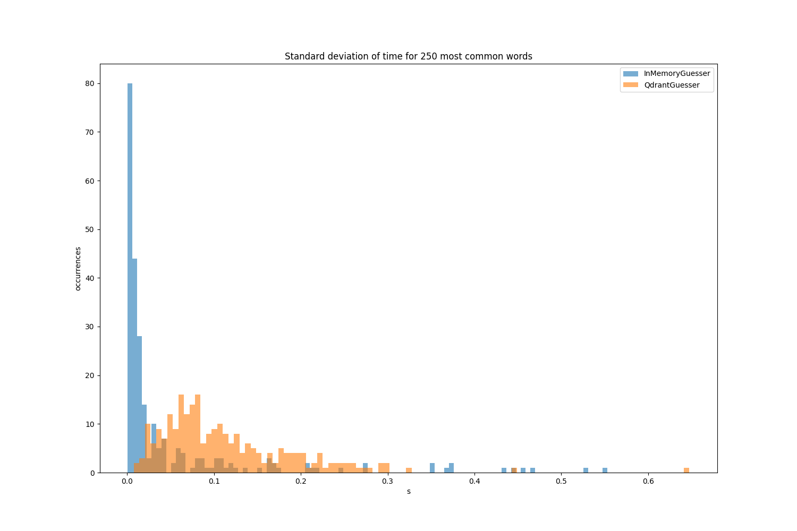

# word-guesser

**Iteratively guessing words until you found the right one.**

<br>
<div align="center">
  
</div>

## The Premise
[Contexto](https://contexto.me/en/) is a word guessing game that is based on word similarity. Their is a target word unknown to the user. The user makes guesses and gets feedback on how similar the guess is to the target word. Similarity is not expressed as a continuous metric, but rather in how high the guess ranks with regard to similarity to the target. 

## Considerations
To solve the game, a player has to have a similar notion of what it means for two words to be similar to each other, as the creators of the game do.
Under the hood, Contexto is using [GloVe embeddings](https://nlp.stanford.edu/projects/glove/) to measure word similarities.
Furthermore, the players need to have a roughly similar vocabulary as the game to interpret the ranking. It is of course crucial that the target word is in the player's vocabulary.
In this implementation, both the game as well as the players rely on the same vocabularies, embeddings and notions of similarity (namely cosine similarity).

## Solve Contexto automatically
Before conceptualizing about a solution, it's best to think about how a human player might play the game. They will start with one or multiple guesses that are more or less random. Once they received feedback about their scores, they will favor words that are similar to good guesses and different to bad guesses.

### The QdrantWordGuesser
The QdrantWordGuesser uses Qdrant to store its vocabulary and embeddings. To select next guesses it uses Qdrant's recommendation function. It always chooses the best previous guess as a positive example and the other guesses as negative examples.
For more details see the [Vector Similarity: Going Beyond Full-Text Search | Qdrant](https://qdrant.tech/articles/vector-similarity-beyond-search/).

### The InMemoryWordGuesser
The InMemoryWordGuesser stores its vocabulary and embeddings in memory. Therefore it can only be used for small vocabulary sizes or low embedding dimensions.
When selecting next guesses it favors words that are similar to good previous guesses and different from bad previous guesses. This is handled using the scoring threshold. For example, a scoring threshold of 0.9999 declares the best possible 0.1% of guesses as good and the others as bad guesses. In contrast to the QdrantWordGuesser, this weighting is not binary but continuously calculated with an exponential score function. The InMemoryWordGuesser further allows favoring commonly used words if supplied with frequencies.

### The HumanGuesser
You can play the game in the console and try to beat the automatic solvers.

## How to run

### Clone the repository
```bash
$ git clone https://github.com/davidschulte/word-guesser.git
```

### Getting the GloVe embeddings
You can download the used GloVe embeddings [here](https://nlp.stanford.edu/data/glove.6B.zip). Alternatively, you can run the script:

```bash
$ ./download_glove_embeddings.sh
```

### Run the demonstration file
```bash
$ python main.py
```

## Evaluation

The two solvers are tested on the top 250 most common words in English according to this [source](https://www.kaggle.com/datasets/rtatman/english-word-frequency). Both solvers choose the first two guesses randomly. To account for that, the solvers run 5 times each on each target word with different starting guesses.
The vocabulary of the game and guessers conisted of the first 10,000 words in the Wikipedia 2014 + Gigaword 5 GloVe embeddings with 50 dimensions.
For the InMemoryProcessor a scoring threshold of 0.5 was used.

|                       |  Avg. # Guesses   |  Avg. Time (s)    |
| :---                  |    :----:         |          ---:     |
| **QdrantGuesser**     | 62                |        0.20       |
| **InMemoryGuesser**   | 799               |        0.11       |


### Distributions across target words

| | |
|:-------------------------:|:-------------------------:|
| |  |
| |  |


## Next steps
There are a number of next steps to take for improving this project

- The InMemoryWordGuesser performs quite poorly. Although it seems very promising to use weighted score that depends on the rank of previous guesses, the approach is not stable. The right value for the scoring threshold is not obvious and depends on the vocabulary size. It would be worth, investigating this approach further.
- The performance of both solvers heavily depens on the first 2 intial guesses. Instead of choosing them randomly, they can be chosen more strategically. How this strategy would like is an interesting question for continuing the project.
- Currently, only cosine similarity is used to measure distance. The solvers should also be evaluated on other distance metrics like Euclidian distance.
- For this first test, only the smallest GloVe embeddings were used. The performance should also be evaluated on other embeddings.
- Adding to the two previous points, currently, both the game and the solvers share the same embeddings and same distance metric. It would be interesting, if the solvers can also play the game if they use other embeddings than the game (e.g. SBERT embeddings) or a different distance metric.
- In the Contexto game, users can request hints if they are lost. It would a fun idea to include this in the project. The question would be, when would a solver best use a hint, if only a limited number of them are available.
